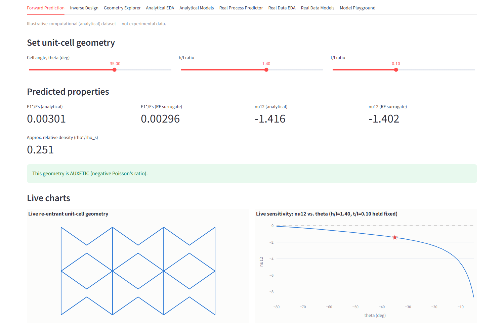
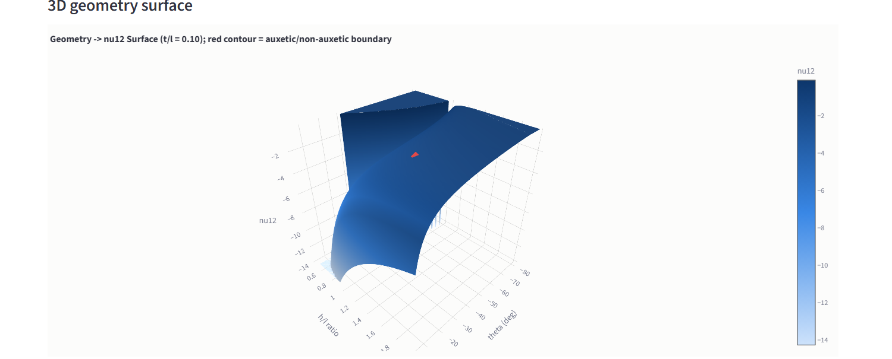
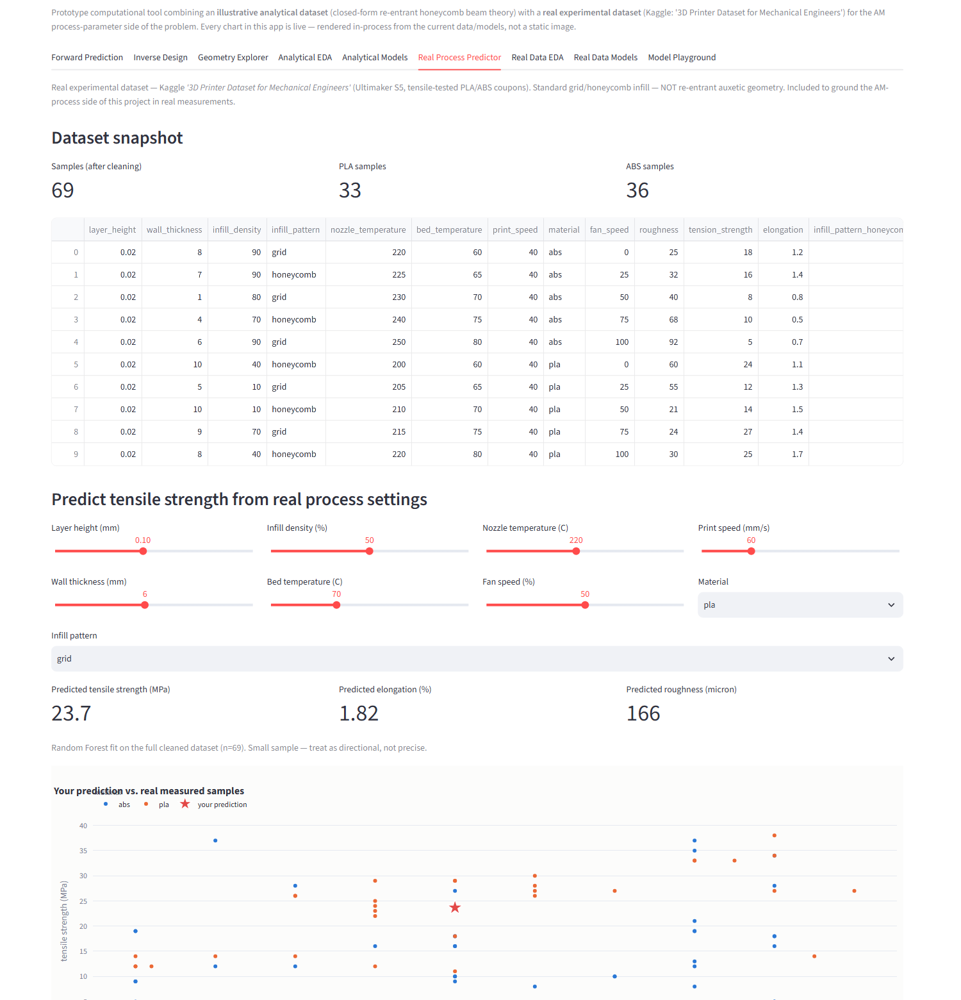

# Auxetic Re-Entrant Lattice — Computational Surrogate & Inverse Design

Computational Design and Machine-Learning-Based Property Prediction of Re-Entrant Auxetic PLA Lattice Structures for Additive Manufacturing

[](https://www.python.org/)
[](https://streamlit.io/)
[](https://scikit-learn.org/)
[](https://plotly.com/)
[](https://www.kaggle.com/datasets/afumetto/3dprinter)
[]()

A computational research prototype combining an analytical mechanics model of
re-entrant auxetic unit cells with a real, publicly available additive
manufacturing dataset, coupled through a machine-learning surrogate,
inverse-design search, and an interactive Streamlit dashboard. 

---

## Preview

**Forward prediction with a live-redrawn unit-cell geometry.** Moving the
geometry sliders (cell angle, h/l, t/l) redraws the re-entrant lattice sketch
and the sensitivity curve in real time, alongside analytical and Random
Forest surrogate predictions.



**3D geometry-to-property surface.** The Geometry Explorer tab renders the
closed-form relationship between cell angle, h/l ratio, and Poisson's ratio
as an interactive surface; the highlighted contour marks the boundary between
auxetic and non-auxetic behavior.



**Real process-parameter predictor.** The Real Process Predictor tab lets a
user set genuine FDM print settings and returns a live tensile-strength,
elongation, and roughness prediction, plotted against the underlying Kaggle
measurements it was trained on.



---

## Data Provenance

The project deliberately combines two datasets of different provenance,
which are never numerically merged:

| | Analytical Dataset | Real Dataset |
|---|---|---|
| Source | Closed-form Gibson–Ashby-type beam theory (`src/generate_dataset.py`) | Kaggle — [3D Printer Dataset for Mechanical Engineers](https://www.kaggle.com/datasets/afumetto/3dprinter) |
| Nature | Illustrative / computational | Real, measured experimental data |
| Subject | Re-entrant auxetic geometry → modulus and Poisson's ratio | FDM process parameters → tensile strength, elongation, roughness (PLA/ABS) |
| Auxetic geometry | Yes | No — standard grid/honeycomb infill |
| Valid samples | 2,562 of 4,000 generated | 69 of 70 (1 sensor-error row removed) |

The analytical dataset characterizes the auxetic mechanism itself; the real
dataset grounds the additive-manufacturing process side of the project in
genuine measurements. Neither is a substitute for the other, and results are
reported separately throughout.

---

## Key Results

**Analytical dataset — best 5-fold cross-validated R² (Gradient Boosting):**

| Target | E1*/Es | E2*/Es | ν12 | ν21 |
|---|---|---|---|---|
| R² | 0.977 | 0.981 | 0.996 | 0.993 |

**Real dataset — best 5-fold cross-validated R² (small sample, n = 69):**

| Target | Tensile Strength | Elongation | Roughness |
|---|---|---|---|
| R² | 0.588 | 0.560 | 0.907 |

Tree-based models (Random Forest, Gradient Boosting) substantially outperform
linear baselines on both datasets. Full metrics, feature importance, and
inverse-design results are in `results/reports/`; all static figures are in
`results/figures/`.

---

## Installation and Usage

```bash
pip install -r requirements.txt

cd src
python generate_dataset.py     # analytical dataset
python eda.py                  # exploratory figures
python evaluation.py           # model training, evaluation, comparison
python sensitivity.py          # feature importance, sensitivity sweeps
python inverse_design.py       # inverse-design queries
python real_data.py            # real dataset: clean, model, evaluate

cd ..
streamlit run app/app.py       # interactive dashboard
```

The dashboard (`app/app.py`) provides nine tabs — Forward Prediction, Inverse
Design, Geometry Explorer, Analytical EDA, Analytical Models, Real Process
Predictor, Real Data EDA, Real Data Models, and Model Playground — each
rendering live, interactive charts computed in-process (`src/dynamic_charts.py`).

---

## Project Structure

```
auxetic-am-surrogate/
├── data/                 raw and processed datasets (analytical + real)
├── src/                  data generation, modeling, evaluation, dashboard charts
├── app/                  Streamlit dashboard
├── results/              figures/ and reports/
├── docs/screenshots/     README preview images
├── SRS.md                software requirements specification
└── requirements.txt
```

---

## Limitations

- The analytical dataset assumes idealized linear-elastic, small-deformation
  beam theory; it is not calibrated against measured PLA data and does not
  capture print-induced anisotropy or defects.
- The real dataset uses standard (non-auxetic) infill and a small sample
  (n = 69); cross-validated metrics carry wide uncertainty and should be
  treated as directional rather than precise.
- The two datasets are presented side by side and are not fused into a single
  model.

